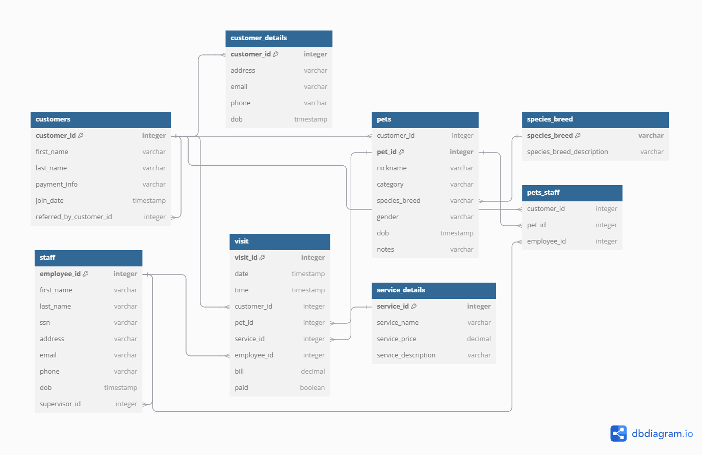

### **Summary of Relationships**:

1. **Customers** → (1:M) → **Pets**
2. **Customers** → (1:1) → **CustomerContact**
3. **Pets** → (M:1) → **Species**
4. **Visit** → (M:1) → **Customers**, **Pets**, **Staff**, and **Service**
5. **Pets_Staff** → (M:N) → **Pets** and **Staff**

